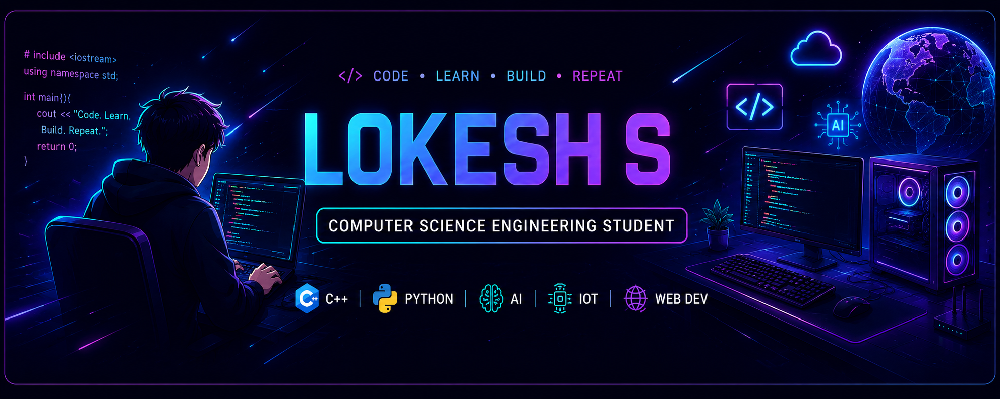

# Hi 👋, I'm Lokesh S

  

  

---

## 🚀 About Me

I'm **Lokesh S**, a **B.E. Computer Science Engineering** student at **Tagore Engineering College**.

I enjoy learning new technologies and building practical software and IoT projects. My interests include **C++, Python, Web Development, Artificial Intelligence, IoT, and GitHub**.

---

## 🎯 Career Objective

To become a Software Engineer by developing strong programming, problem-solving, and full-stack development skills while contributing to meaningful open-source projects.

---

## 🎓 Education

**Bachelor of Engineering (Computer Science and Engineering)**
Tagore Engineering College
2025 – 2029

---

## 🛠️ Tech Stack

---

## 🌱 Currently Learning

* Data Structures & Algorithms
* Object-Oriented Programming
* Web Development
* Database Management Systems
* Artificial Intelligence

---

## 🚀 Featured Projects

### ♻️ Smart Dustbin using Arduino & ESP8266

An IoT project that detects garbage levels using ultrasonic sensors and notifies users when the bin is full.

### 💻 C++ OOP Programs

A collection of object-oriented programming examples covering inheritance, polymorphism, templates, and file handling.

### 📚 Data Structures Programs

Implementations of arrays, linked lists, stacks, queues, trees, and sorting algorithms in C++.

### 🌐 Personal Portfolio Website

A responsive portfolio website showcasing my projects and skills.

---

## 📊 GitHub Stats

---

## 📫 Connect With Me

📧 Email: [kalailokesh234@gmail.com](mailto:kalailokesh234@gmail.com)

💼 LinkedIn: *(Add your LinkedIn URL here)*

📍 Chennai, Tamil Nadu, India

---

## 💡 Motto

> "Learn continuously, build consistently, and improve every day."

⭐ Thanks for visiting my GitHub profile!
